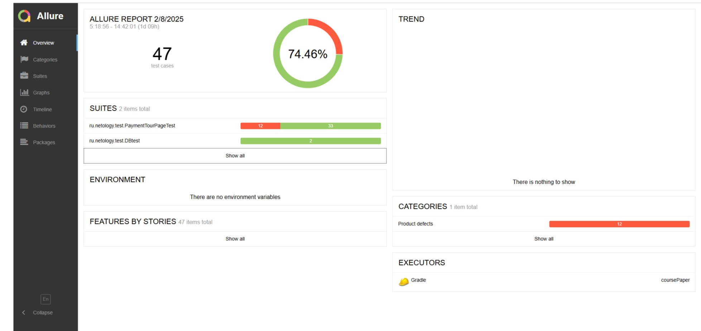

# Отчет о тестировании

В рамках данного проекта было выполнено тестирование сервиса покупки тура, который осуществляет взаимодействие с базой
данных и API банка.

## Тест-кейсы

Было автоматизировано 47 тест-кейсов:

1. 45 UI теста
2. 2 теста с запросами в БД

## Успешность тест-кейсов

Из 47 тест-кейсов: 12 не прошли, 35 прошли.
Итого: 74,46% (успешных) / 25,53% (неуспешных)

## Общие рекомендации по итогам тестирования

1. Разработать документацию для полей обеих форм.
2. Доработать поле "Владелец" — установить ограничения на количество символов, запретить ввод цифр и знаков,
   запретить ввод ФИО начиная с пробела и заканчивая им, разрешить ввод ФИО только официальное и на английском языке.
3. Удалить второе всплывающее уведомление (ошибка + успех) при вводе недействительной карты.
4. Ввести ограничение на ввод нулей в поле "Месяц".
5. Доработать поле CVC, запрет на ввод 000 или одинаковых чисел в целях безопасности.
6. Изменить списание суммы с 4500000 до правильной 45000.
7. Запретить оплату по недействительной карте.